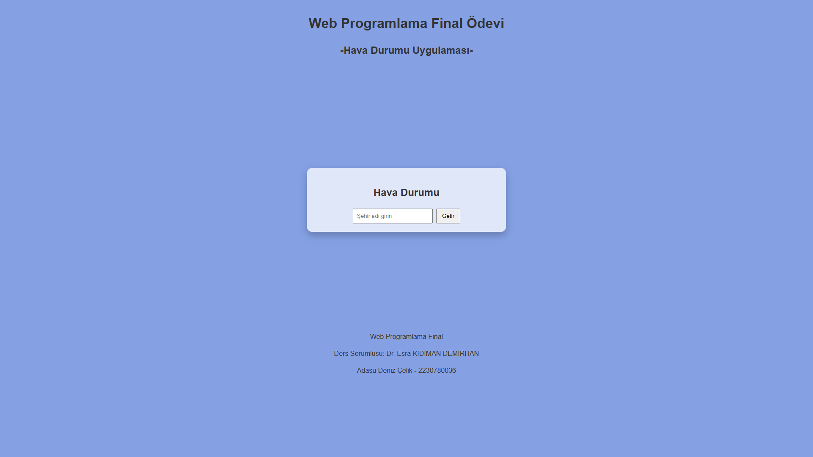
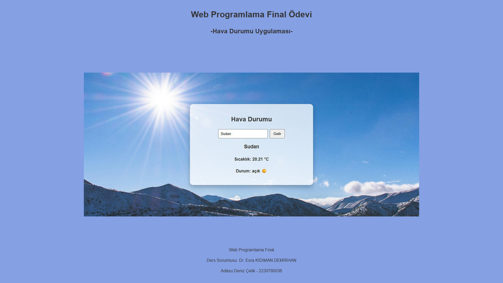
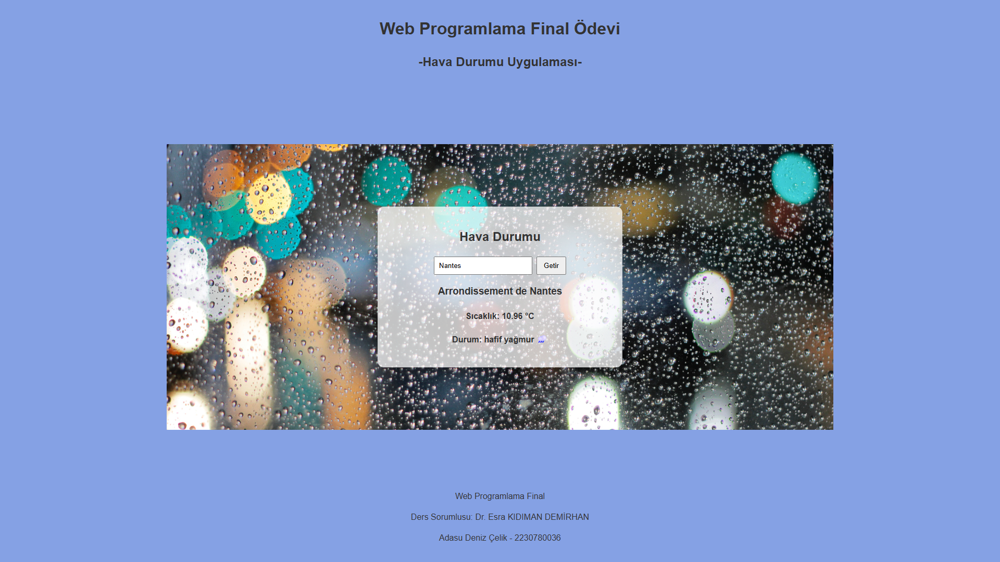
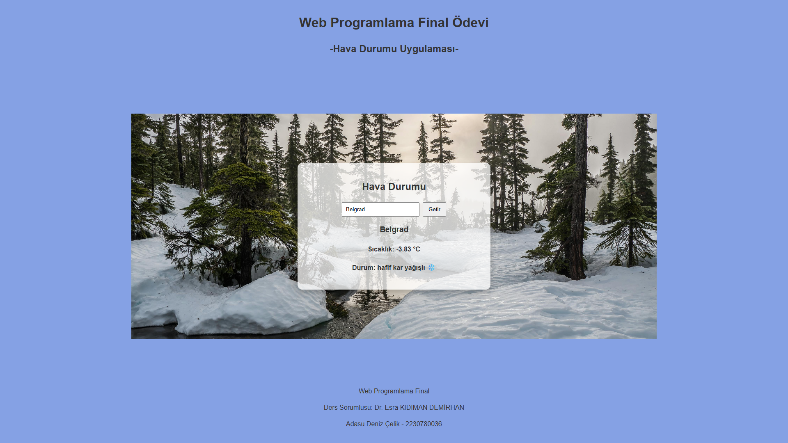
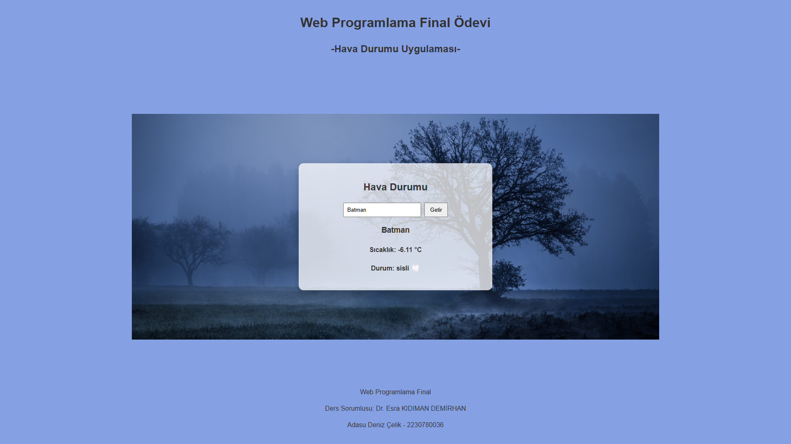

## Kullanılan API
OpenWeather https://openweathermap.org/api

## Projeyi Nasıl Çalıştırabiliriz?
1. Terminali açın ve proje klasörüne gidin.
2. Gerekli paketi kurmak için "npm install" yazın.
3. "npm run dev" yazın ve projeyi başlatın.
4. Son olarak şu adrese gidin:
http://localhost:5173

## Ekran Görüntüleri
### Ana Sayfa

### Hava Durumu Görüntüleri

